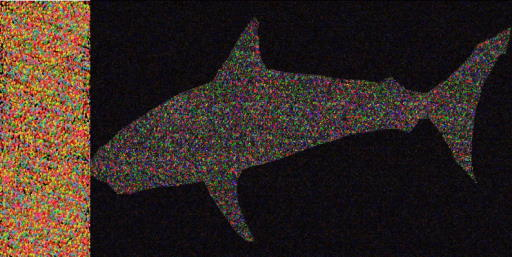
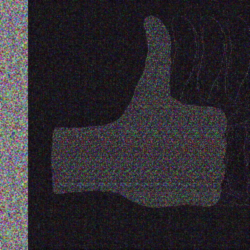
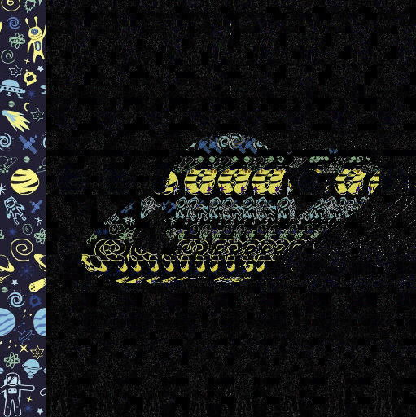
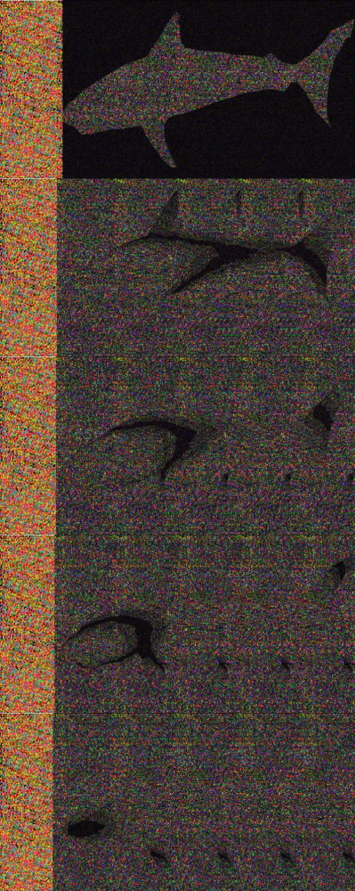
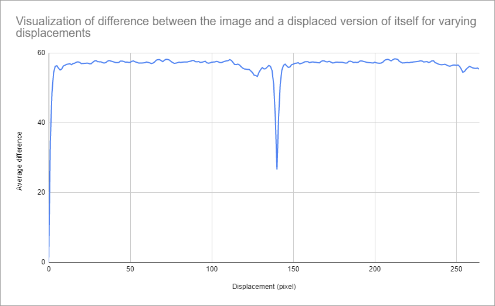
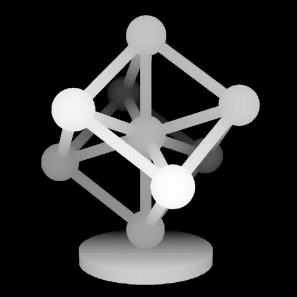
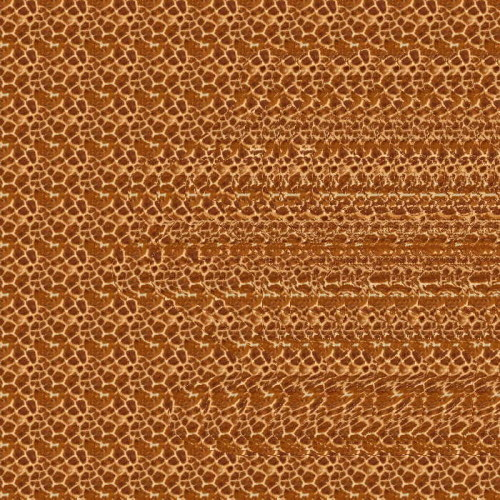
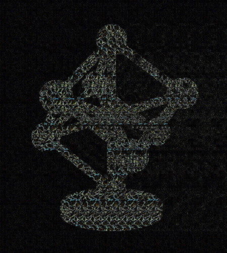

# stereogram-solver
An autostereogram (also known as Magic Eye) is a 2D image designed to create the illusion of 3D. In each image, there is a 3D object that can only be viewed by looking at the image a certain way, as if the screen was transparent and you looked at the wall behind it.

Correctly viewing a Magic Eye definitely takes some practice, and some people are completely unable to see them. This website is a tool to reveal the 3D scene hidden in a stereogram by revealing its silhouette. It works for most of autosterograms, especially if they have a simple plane as background.

See it live [here](https://piellardj.github.io/stereogram-solver/).

See my Magic Eye generator [here](https://piellardj.github.io/stereogram-webgl/).

## Preview

## Algorithm
As described in my Magic Eye generator project, a stereogram is all about horizontal repetition of a certain pattern, and the repetition frequency depends on the local depth of the scene.

This means that to reconstruct a depth map from a stereogram, we can first try to determine the frequency, and then we rebuild the depth map from it. In this project, I simply compute the difference between the image and a shifted version of itself. This way, when I hit the right period, the difference is very small and the pixels appear black. This can very easily be visualized by slowly moving the slider that controls the size of the lateral shift.

    
    

        <i>By varying the displacement, one can clearly see the 3D at different depths.</i>
    

In theory, I could use this technique to automatically rebuild a full depth map of the image, however I did not achieve great result with it. My guess is that I would need to apply a kind of blur to the source image beforehand, in order to remove artifacts. This is why I restricted my self to building only a binary version of the depth map: I determine what is in the background (black) and the rest of the scene is only shown as a colored silhouette. Of course, this only works for stereograms that have a background plane. For stereograms that don't, for instance a ripple that takes the whole image, this technique is not very effective. Moving the slider manually can still give an idea of the scene.

To determine the period of the background plane, I compute the global difference for varying displacements, and choose the best one based on its value and its neighbours. Here is an example of curve showing how the difference varies with displacement:

    
    

        <i>The period of repetition for the background for the shark image is clearly visible around 140px.</i>
    

## Results
I obtained surprisingly good results with this technique. It is also quite resistant to image alterations, such as jpeg artifacts, blur, black and white transformation, etc.

Here is a comparison between a source depth map, the corresponding stereogram, and the reconstruction of the depth map with this technique:

    
    

        <i>Source depth map.</i>
    

    
    

        <i>Corresponding stereogram</i>
    

    
    

        <i>Depth map rebuilt by analyzing the Magic Eye image.</i>
    

## CORS issues
For this project I encountered a Cross-origin resource sharing (CORS) issue I did not expect.

This website gives the user the possibility to load an image from any URL. Most of the time, the URL is from another website, so the image is cross-origin. As described [here](https://developer.mozilla.org/fr/docs/Web/HTTP/CORS), cross-origin requests have a few quirks. The base idea is that cross-origin resources hosted on a domain A can only be read from a domain B if B declared by A as an allowed domain. The domain A declares the allowed domains in an allow-list provided in the `Access-Control-Allow-Origin` response header. If not allowed, queries from B to A are blocked; for instance, any unauthorized cross-origin `XMLHttpRequest` fails.

In this case, I discovered the browser allows even a cross-origin image to be loaded if I use directly an `Image` object in javascript. It can even be displayed in the canvas2D with the `CanvasRenderingContext2D.drawImage()` API. However the browser prevents the image data from being accessed: using the `CanvasRenderingContext2D.getImageData()` API fails, and the browser throws an exception:
`Uncaught DOMException: Failed to execute 'getImageData' on 'CanvasRenderingContext2D': The canvas has been tainted by cross-origin data.` This means that a cross-origin image can only be displayed: drawing it to a canvas makes the canvas is tainted (= unsafe), and then any attempt to read back the canvas data are blocked for security reasons.

I did not find a way to allow the reading a tainted canvas. This means the solution is to prevent the canvas from being tainted in the first place.

In order to do this, I have to make sure the manipulation of the cross-origin image is allowed on my domain (piellardj.github.io). What I need is my domain to be in the `Access-Control-Allow-Origin` response header. However, I do not control which domains are allowed by the foreign domains hosting the cross-origin image.

The trick is to make the browser believe the image is allowed on my domain by using of a CORS proxy. The proper way to do it would have been to create my own on my domain piellardj.github.io, however it requires server code and Github Pages does not support this.

This is why I have to rely on an external proxy. Here is how it works: I provide the URL of the image to the proxy, the proxy fetches it for me, then adds a `Access-Control-Allow-Origin=*` header to the response, then sends the response to the browser. This way, the browser believes my domain is allowed, so the canvas is not tainted, and I can read back its pixel data. A quick search shows there are many CORS proxy available. I chose https://cors-anywhere.herokuapp.com/ and it works great.
